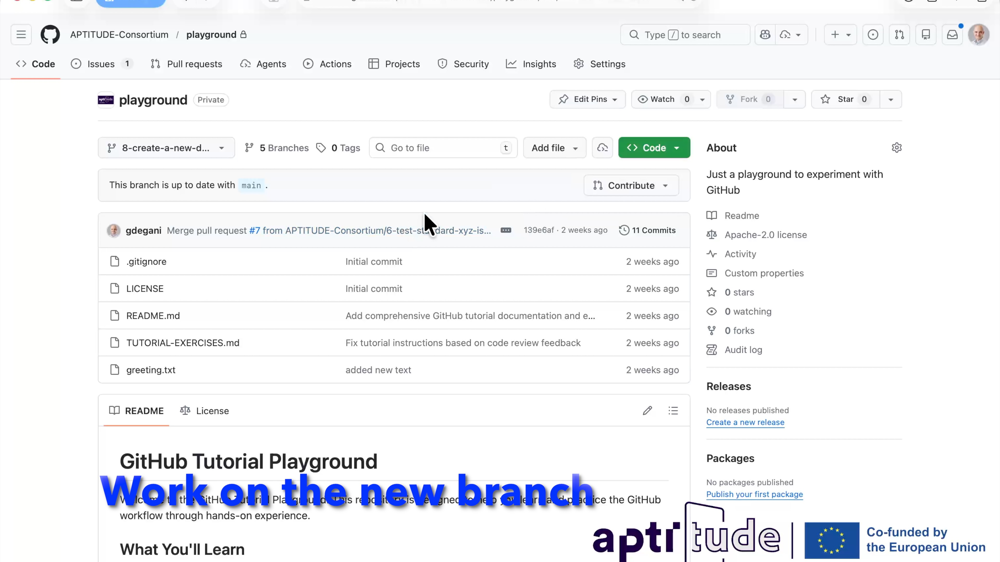
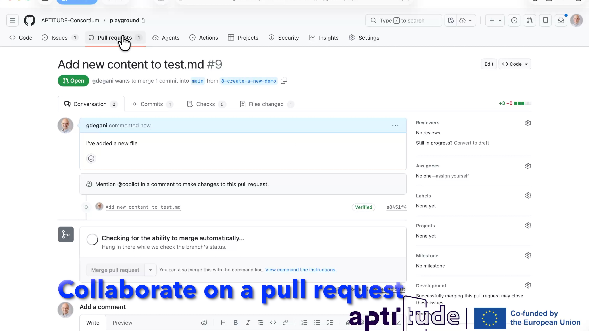

# GitHub Co‑Editing Workflow for Technical Docs

This document summarizes the standard GitHub workflow for co‑editing technical documentation. It combines the tutorial overview and exercises into a single, concise reference.

## Purpose and Scope

Use this workflow when multiple contributors collaborate on documentation updates (RFCs, guides, or specifications). It focuses on clarity, traceability, and review quality.

## How to Contribute

You can contribute to this project in two ways:

1. **Using the GitHub Web UI** — Edit files directly on GitHub without installing anything on your computer. This is the simplest option for small changes like fixing text, adding content, or updating a single file. Just navigate to the file, click the edit (pencil) icon, make your changes, and open a Pull Request.
2. **Using a local clone** — Clone the repository to your machine, edit files with your preferred editor, and push changes back. This approach is better for larger changes, working with multiple files, or previewing the MkDocs site locally (see [CONTRIBUTING.md](CONTRIBUTING.md) for local setup instructions).

Both approaches follow the same workflow described below.

## End‑to‑End Flow (Summary)

```text
1. Create an Issue
   ↓
2. Discuss and refine scope
   ↓
3. Create a branch
   ↓
4. Draft and commit changes
   ↓
5. Open a Pull Request (PR)
   ↓
6. Review and comment
   ↓
7. Approve
   ↓
8. Merge and close
```

## Step‑by‑Step Workflow

### 1) Create an Issue

Issues capture intent and provide a shared place for discussion.

**Recommended actions:**

1. Open a new issue with a clear, descriptive title.
2. Explain the change request and desired outcome.
3. Add labels (e.g., documentation) and assign owners.
4. Link relevant RFCs or references for context.

**Success criteria:** clear scope, traceable context, and agreed ownership.

[](https://www.youtube.com/watch?v=2nB20Zrgp6k)

---

### 2) Discuss and Refine Scope

Use the issue thread to align on goals, constraints, and structure.

**Recommended actions:**

- Ask clarifying questions and propose a plan.
- Suggest a section outline or document structure.
- Capture assumptions and open questions.

**Success criteria:** alignment on intent and expected deliverables.

---

### 3) Create a Branch

Work in an isolated branch to keep changes reviewable.

**Example (local):**

- Create a branch named after the issue or topic (e.g., `docs-issue-123`).

**Success criteria:** changes are isolated to a single topic.

[](https://www.youtube.com/watch?v=Gf9kHsdcLP4)

---

### 4) Draft and Commit Changes

Edit the relevant documentation files and commit small, coherent updates.

**Recommended actions:**

- Keep commits focused and descriptive.
- Reference the issue in the commit message (e.g., “Closes #123”).

**Success criteria:** changes are scoped, readable, and traceable.


[](https://youtu.be/K6luurzhRLw)

---

### 5) Open a Pull Request

PRs are the central review artifact for documentation changes.

**Recommended actions:**

1. Open a PR from your branch.
2. Add a clear title and description.
3. Reference the issue using “Closes #123” or “Fixes #123”.
4. Summarize what changed and why.

**Success criteria:** reviewers can understand the change quickly.

[](https://www.youtube.com/watch?v=EUU0MfJ5Xl4)

---

### 6) Review and Comment

Collaborative review improves quality and alignment.

**Recommended actions:**

- Add inline comments on specific lines.
- Add a general review comment when needed.
- Ask for clarification rather than assuming intent.

**Success criteria:** feedback is actionable and respectful.

[](https://youtu.be/iYuXv7acKws)

---

### 7) Approve

Approval confirms the change meets expectations.

**Recommended actions:**

- Approve when scope, clarity, and formatting are acceptable.
- Note any follow‑ups separately if needed.

**Success criteria:** clear approval recorded in the PR.

---

### 8) Merge and Close

Merging finalizes the change and closes the loop with the issue.

**Recommended actions:**

1. Merge the PR after required approvals.
2. Prefer squash merge for clean history unless team policy differs.
3. Delete the branch once merged.
4. Confirm the linked issue closes automatically.

**Success criteria:** documentation updated and issue closed.

## Best Practices

### Issues

- Use clear titles and concise descriptions.
- Add labels for discoverability.
- Keep scope small and reviewable.

### Pull Requests

- Keep PRs focused on a single topic.
- Provide a brief summary and impact.
- Link to the issue and relevant RFCs.

### Reviews

- Be constructive and specific.
- Suggest improvements, not just problems.
- Verify the change aligns with the agreed scope.

## Reference Video

This workflow is demonstrated in the project’s internal video tutorial:

- [APTITUDE GitHub Demo](https://youtu.be/gE_wK7YNz4w)

## Quick Checklist

- [ ] Issue created and scoped
- [ ] Discussion completed in issue
- [ ] Branch created
- [ ] Changes committed with issue reference
- [ ] PR opened and linked to issue
- [ ] Review comments addressed
- [ ] Approval recorded
- [ ] PR merged and issue closed

## External references

- Tutorials
  - [Visual Tutorial on Git](https://learngitbranching.js.org/)
  - [Git Basics](https://docs.github.com/en/get-started/git-basics)
- Tools
  - [Visual Studio Code](https://code.visualstudio.com/download)
  - [GitHub Desktop](https://desktop.github.com/download/)
  